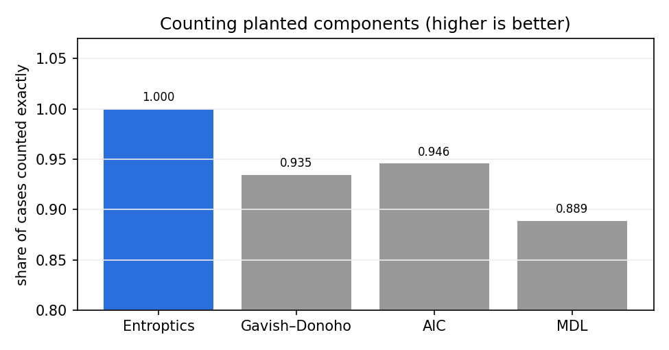
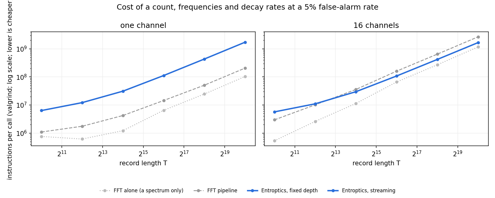
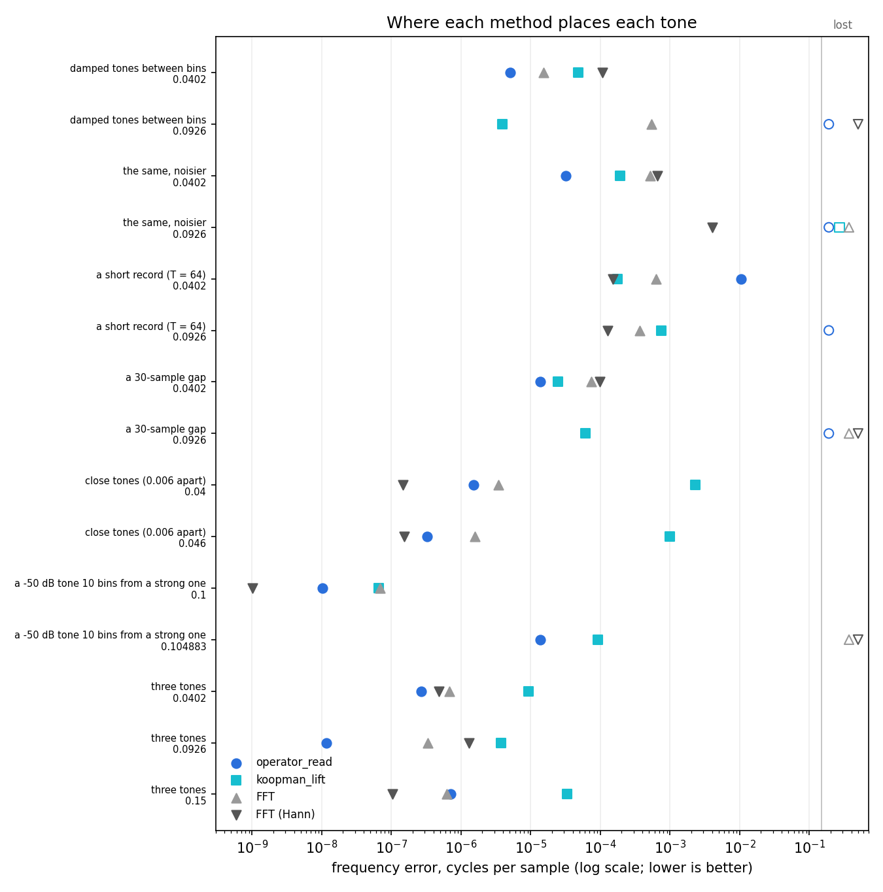
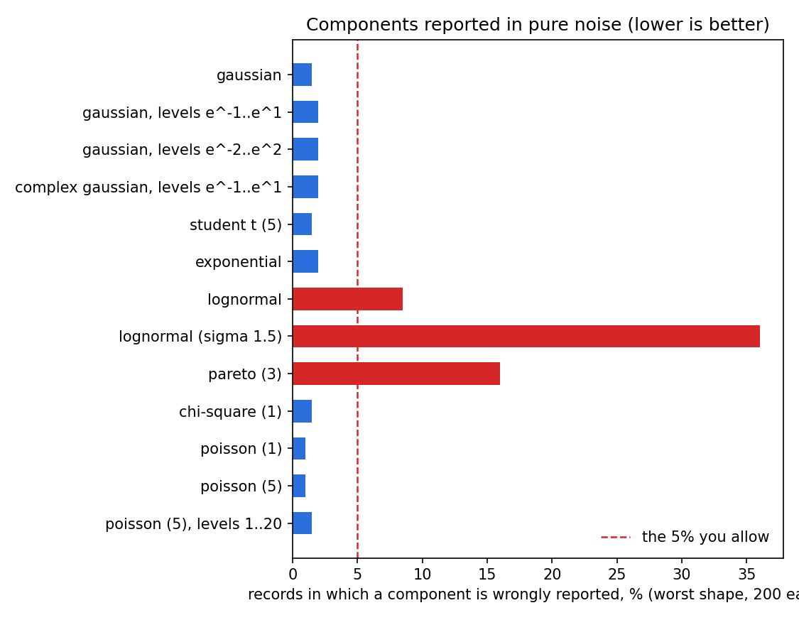

# Benchmarks

Entroptics against the standard tools: the standard rank selectors for counting components, and
the FFT for cost, decay rates and tones. Every number on this page comes from a script whose output
is committed beside it. The figures and tables are drawn from those outputs by
[`figures.py`](figures.py).

## The results

| question | Entroptics | best alternative | winner |
|---|---|---|---|
| [Counting components exactly](#1-counting-components) (27 planted cases) | **1.000** | AIC 0.946, Gavish–Donoho 0.935, MDL 0.889 | **Entroptics** |
| [Components reported in correlated noise](#1-counting-components), nothing planted (lower is better) | **9.0** | Gavish–Donoho 17.9, MDL 18.9, AIC 44.7 | **Entroptics** |
| [Decay rates of damped tones](#3-against-the-fft-on-tones) (8 tones) | **best on 5** (fixed depth) | FFT pipeline, best on 3 | **Entroptics** |
| [Placing tone frequencies](#3-against-the-fft-on-tones) (15 tones) | **best on 8** | FFT pipeline, best on 7 | **Entroptics** |
| [Counting tones](#3-against-the-fft-on-tones) (7 records) | exact on 3, closer on 2 | FFT pipeline: exact on 4, closer on 1 | even |
| [Cost of a full read](#2-cost), 16 channels, T = 16384 to 1M (instructions per call) | **29.7 M–1.66 G** | FFT pipeline, 35.7 M–2.66 G | **Entroptics**, 1.2–1.6× fewer |
| [Cost of a full read](#2-cost), 16 channels, T up to 4096 | 5.7–11.0 M | **FFT pipeline, 3.0–10.1 M** | FFT |
| [Cost of a full read](#2-cost), one channel (instructions per call) | 6.4 M–1.72 G | **FFT pipeline, 1.1 M–206 M** | FFT, 5.8–8.5× fewer |

Two more checks of the count:
- **[Pure noise](#4-pure-noise).** Entroptics reports a component in the 5% of noise records you
  allow, for every kind of noise tested, very heavy right tails included: 4.1–6.2% pooled over six
  record shapes. The closed-form edge it used to take reached 36% (lognormal) and 16% (Pareto).
- **[Planted signals](#5-planted-signals).** A component spread across the channels is found in
  95–100% of records.

### The methods

| name on this page | in Entroptics? | what it is |
|---|---|---|
| **Entroptics** | yes | the component count, `Projection(W).K_signal` |
| **Entroptics, streaming** | yes | `Aperture(W).dynamics()`, then `.resolved()` (the count) and `.modes()` (frequencies, decay rates, powers) |
| **Entroptics, fixed depth** | yes | `koopman_lift(x, 16)`, then `.resolved()` and `.modes()`: one channel read at a delay depth of 16 |
| **Entroptics, automatic depth** | yes (`entroptics.experimental`) | `operator_read(x)`: the count, the depth and the modes all read from the record |
| **FFT alone** | no | `scipy.fft.rfft`: a spectrum only, with no count or decay rates; shown for scale |
| **FFT pipeline** | no | what it takes to get Entroptics' outputs from an FFT (`fft_pipeline` in [`operator_vs_fft.py`](operator_vs_fft.py)): one FFT per channel; peaks counted above the noise at the same 5% false-alarm rate; each peak's frequency interpolated and its decay rate read from its line width. Hann-windowed; section 3 also runs it unwindowed |
| **Gavish–Donoho**, **AIC**, **MDL** | no | the standard rank selectors: the optimal hard threshold, and Wax–Kailath's two information criteria |

## 1. Counting components

**The test.** Plant 1, 3 or 5 components in noise, at three strengths and several record shapes
(30 records each), and ask each method how many there are.



| method | counted exactly | components reported in correlated noise, nothing planted |
|---|---|---|
| **Entroptics** | **1.000** | **9.0** |
| Gavish–Donoho | 0.935 | 17.9 |
| AIC | 0.946 | 44.7 |
| MDL | 0.889 | 18.9 |

Both columns average over the cases all four methods cover: AIC and MDL do not apply to square
records, which leaves 27 planted cases and two record shapes of correlated noise. Entroptics also
counts the 9 square cases exactly. It needs no tuning and no known noise level. Gavish–Donoho misses
weak components when there are five of them (0.40–0.53 at the weakest strength).

The right-hand column is serially correlated noise with nothing planted. Correlation in time
genuinely lifts the noise above the level independent noise would reach, so the methods report
components there; Entroptics reports the fewest on average.

Scripts: [`exp17_rank_baselines.py`](../validation/exp17_rank_baselines.py) and
[`exp18_coloured_null.py`](../validation/exp18_coloured_null.py), results in sections 17 and 18 of
[`RESULTS.md`](../validation/RESULTS.md).

## 2. Cost

**The test.** Two tones in white noise, each channel with its own phases. Every method returns the
same things: how many components there are at a 5% false-alarm rate, and each one's frequency,
decay rate and power. Cost is counted as retired instructions per call, by valgrind, on one thread:
the release's own measure, which carries neither the host's load nor its clock. Each count is the
difference between a run that makes the call three times and the same run without it, taken twice.



K is the count, and the truth is 4 in every row:
- **The FFT pipeline** counts peaks. A tone counts as two components, its positive- and
  negative-frequency pair.
- **The streaming read** counts independent patterns across the channels. Two tones, each at its own
  phase in every channel, make four.

The cheaper full read is in bold. Instructions per call, in millions.

**16 channels.**

| T | FFT alone (a spectrum only) | FFT pipeline | Entroptics, streaming |
|---|---|---|---|
| 1024 | 0.53 ± 0.21 | **2.96 ± 0.34** (K 4) | 5.69 (K 4) |
| 4096 | 2.60 | **10.1** (K 4) | 11.0 (K 3) |
| 16384 | 11.3 | 35.7 (K 4) | **29.7** (K 4) |
| 65536 | 65.9 | 160 (K 4) | **108** (K 4) |
| 262144 | 270 | 646 (K 4) | **419** (K 3) |
| 1048576 | 1,170 | 2,660 (K 6) | **1,660** (K 4) |

- **Cost.** From T = 16384 the streaming read takes 1.2–1.6× fewer instructions than the FFT
  pipeline; at T = 4096 they are level, and below it the pipeline is cheaper.
- **Why it scales.** It folds each frame into a fixed-size summary, then reads its floor off the
  window it holds: a few passes over the record, against the FFT's T log T once per channel and the
  pipeline's work through the spectrum.
- **The floor.** Where no single row can carry a noise eigenvalue over the closed-form edge, that
  edge is the floor, at no draws. Where one can -- very heavy right tails -- the floor is the exact
  permutation test, whose false-alarm rate is the 5% you allow whatever the noise
  ([section 4](#4-pure-noise)); its 19 draws each pass over the record. The pipeline's peak test
  assumes Gaussian noise.
- **Where it misses.** At T = 4096 and 262144 it counts 3, missing one of the weaker tone's two
  patterns.

**One channel.**

| T | FFT alone (a spectrum only) | FFT pipeline | Entroptics, fixed depth |
|---|---|---|---|
| 1024 | 0.76 ± 0.37 | **1.09** (K 4) | 6.35 (K 4) |
| 4096 | 0.61 ± 0.09 | **1.75 ± 0.71** (K 4) | 12.2 (K 4) |
| 16384 | 1.22 ± 0.53 | **4.23** (K 4) | 31.1 (K 4) |
| 65536 | 6.49 | **14.5** (K 6) | 112 (K 4) |
| 262144 | 24.6 | **50.8** (K 4) | 433 (K 4) |
| 1048576 | 103 | **206** (K 4) | 1,720 (K 4) |

- **The FFT pipeline wins on one channel,** with 5.8–8.5× fewer instructions than the fixed-depth
  read. The fixed-depth read lifts the channel to 16 delays and reads them as 16 channels. It counts
  right at every length.
- A call of under a few million instructions is near the measurement's own noise; those cells carry
  their spread.

Scripts: [`count_vs_fft.py`](count_vs_fft.py) → [`count_vs_fft.jsonl`](count_vs_fft.jsonl) (the
instructions), and [`operator_vs_fft.py`](operator_vs_fft.py) →
[`operator_vs_fft.jsonl`](operator_vs_fft.jsonl) (the counts, and the same reads' wall-clock times on
the host that ran them).

## 3. Against the FFT on tones

**The test.** Seven records built to be hard in different ways: tones that decay, a gap in the
record, a very short record, tones close together, a weak tone beside a strong one. For decay rates
and counts, the FFT pipeline runs both Hann-windowed and unwindowed, and each row credits it with
whichever reads closer to the truth. That gives the FFT the benefit of knowing the answer.

**Decay rates.** How fast each damped tone dies away; the FFT reads it from how wide its peak is.
Closest to the truth in bold.

| record | tone | true decay | Entroptics, automatic depth | Entroptics, fixed depth | FFT pipeline |
|---|---|---|---|---|---|
| two damped tones between the FFT's bins, T = 1024, σ = 0.02 | 0.0402 | 0.010 | 0.0090 | **0.0105** | 0.0092 |
| | 0.0926 | 0.030 | lost | **0.0315** | 0.0275 |
| the same, σ = 0.1 | 0.0402 | 0.010 | 0.0089 | 0.0152 | **0.0092** |
| | 0.0926 | 0.030 | lost | lost | **0.0057** |
| the same, T = 64 | 0.0402 | 0.010 | 0.1093 | **0.0098** | 0.0000 |
| | 0.0926 | 0.030 | lost | **0.0301** | 0.0362 |
| the same across a 30-sample gap | 0.0402 | 0.010 | 0.0086 | **0.0102** | 0.0097 |
| | 0.0926 | 0.030 | lost | 0.0326 | **0.0287** |

The fixed-depth read is closest on 5 of the 8 tones, and within 9% of the truth on every tone it
places except in the noisiest record. The FFT pipeline is closest on 3. One of those is the noisy
0.030 tone, which only the FFT places, at 0.0057.

**Counting tones.** Components counted on each record, a tone counting as two. Closest to the truth
in bold.

| record | true | Entroptics, automatic depth | FFT pipeline |
|---|---|---|---|
| two damped tones between the FFT's bins | 4 | **3** | 2 |
| the same, σ = 0.1 | 4 | **2** | **2** |
| the same, T = 64 | 4 | 2 | **4** |
| the same across a 30-sample gap | 4 | **3** | 2 |
| two tones 0.006 apart | 4 | **4** | **4** |
| a −50 dB tone 10 bins from a strong one | 4 | **4** | **4** |
| three tones | 6 | **6** | **6** |

**Frequencies.** Each tone's frequency error, in cycles per sample, from each method's own counted
peaks or modes. Lower is better; the best in each row is in bold. "Lost" means the method has no
estimate within half the gap to the nearest other tone.



| record | tone | Entroptics, automatic depth | Entroptics, fixed depth | FFT pipeline, unwindowed | FFT pipeline, Hann | best |
|---|---|---|---|---|---|---|
| two damped tones between the FFT's bins, T = 1024, σ = 0.02 | 0.0402 | **5.0e-06** | 4.8e-05 | 1.5e-05 | 1.1e-04 | Entroptics |
| | 0.0926 | lost | **3.9e-06** | 5.3e-04 | lost | Entroptics |
| the same, σ = 0.1 | 0.0402 | **3.2e-05** | 1.9e-04 | 5.2e-04 | 6.6e-04 | Entroptics |
| | 0.0926 | lost | lost | **2.0e-03** | lost | FFT |
| the same, T = 64 | 0.0402 | 1.0e-02 | 1.8e-04 | 6.3e-04 | **1.5e-04** | FFT |
| | 0.0926 | lost | 7.5e-04 | 3.7e-04 | **8.5e-05** | FFT |
| the same across a 30-sample gap | 0.0402 | **1.4e-05** | 2.5e-05 | 7.3e-05 | 9.9e-05 | Entroptics |
| | 0.0926 | lost | **6.1e-05** | 5.6e-04 | lost | Entroptics |
| two tones 0.006 apart, T = 2048, σ = 0.05 | 0.040 | 1.5e-06 | 2.3e-03 | 3.4e-06 | **1.5e-07** | FFT |
| | 0.046 | 3.2e-07 | 9.9e-04 | 1.6e-06 | **1.5e-07** | FFT |
| a −50 dB tone 10 bins from a strong one, σ = 1e-4 | 0.1 | 1.0e-08 | 6.5e-08 | 6.9e-08 | **1.0e-09** | FFT |
| | 0.1049 (−50 dB) | **1.4e-05** | 9.1e-05 | 2.3e-04 | 6.9e-05 | Entroptics |
| three tones, T = 2048, σ = 0.05 | 0.0402 | **2.6e-07** | 9.3e-06 | 6.8e-07 | 4.8e-07 | Entroptics |
| | 0.0926 | **1.2e-08** | 3.7e-06 | 3.3e-07 | 1.3e-06 | Entroptics |
| | 0.15 | 7.0e-07 | 3.3e-05 | 6.2e-07 | **1.0e-07** | FFT |

Where each method wins:
- **Entroptics:** both tones of the clean damped record, the stronger tone of the noisier one, both
  tones across the gap, the weak tone beside the strong one, and two of the three tones on the
  three-tone record.
- **The FFT pipeline:** the shortest record, the two close tones, the strong tone of the −50 dB
  pair, the third tone, and one noisy decaying tone.

Script: [`operator_vs_fft.py`](operator_vs_fft.py) → [`operator_vs_fft.jsonl`](operator_vs_fft.jsonl).

## 4. Pure noise

**The test.** Feed Entroptics records with nothing in them and count how often it reports a
component anyway. You choose how often that is acceptable: 5% by default.

**The result.** At the 5% you allow, for every kind of noise tested, very heavy right tails
included. The closed-form edge Entroptics took before 0.2.7, beside it, over-reads heavy tails.



Over 200 records per shape, six record shapes (256 × 8 to 20 × 1000) pooled per kind of noise; `±` is
the binomial standard error of the pooled rate at 5%. "Within" allows the rate that noise across the
13 kinds, at the release gate's family-wise level.

| noise | Entroptics (exact floor) | closed-form edge | within the 5% you allowed? |
|---|---|---|---|
| Gaussian | 4.5% ± 0.6 | 0.9% | yes |
| Gaussian, channels at different levels (e^-1 .. e^1) | 5.1% ± 0.6 | 1.2% | yes |
| Gaussian, channels at different levels (e^-2 .. e^2) | 5.3% ± 0.6 | 1.3% | yes |
| complex Gaussian, channels at different levels | 5.0% ± 0.6 | 1.0% | yes |
| Student t (5), occasional large values | 5.4% ± 0.6 | 0.6% | yes |
| exponential, lopsided | 4.1% ± 0.6 | 0.8% | yes |
| χ² (1), lopsided | 4.9% ± 0.6 | 0.8% | yes |
| Poisson (1), counts | 4.1% ± 0.6 | 0.2% | yes |
| Poisson (5), counts | 5.5% ± 0.6 | 0.6% | yes |
| Poisson (5), counts at different levels | 4.8% ± 0.6 | 1.0% | yes |
| lognormal (σ = 1), very heavy right tail | 6.2% ± 0.6 | 4.3% | yes |
| lognormal (σ = 1.5), very heavy right tail | 5.6% ± 0.6 | 14.1% | yes |
| Pareto (3), very heavy right tail | 4.4% ± 0.6 | 5.5% | yes |

**Why it holds.** Every channel is scaled to the same size before the count, so the count asks only
whether channels move together. Entroptics answers by shuffling each channel in time -- which keeps
every channel's values and destroys their alignment -- and reading the shuffled record the same way,
nineteen times. Pure noise is then one of twenty equally likely records, so the real one lands above
the highest shuffle one time in twenty, whatever the noise's distribution: that is the 5%.

The closed-form edge instead assumes the law a Gaussian record's largest pattern follows
(Tracy–Widom). Light tails reach it with room to spare, which is why it reports so little; very heavy
right tails reach it slowly (lognormal) or not at all (Pareto (3), whose fourth moment is infinite),
and their extreme values cross it more often the longer the record: at 1024 samples × 64 channels,
36% for lognormal (σ = 1.5) and 16% for Pareto (3). It remains the floor where only a covariance is
held, and `null=null_providers.mp` asks for it.

Script: [`screen_null.py`](screen_null.py) → [`screen_null.jsonl`](screen_null.jsonl). Its masked
rows show the same level with cells missing: 4.4% pooled over 72 masked cases.

## 5. Planted signals

**The test.** Plant a known signal in noise and check that Entroptics finds it and counts it
exactly, over three record shapes and two channel-level profiles.

| planted signal | found | counted exactly |
|---|---|---|
| a persistent mode across all channels | 100% | 100% |
| a narrow broadband burst | 95–100% | 95–100% |
| three modes just above the noise | 100% | 72–100% |
| two strong modes | 100% | 99–100% |
| a narrowband line in two channels | 4–35% | 4–35% |

A component has to span enough channels to stand above the noise: more than about `(1 + √(F/T))²`.
That is two channels on a long record, and nine for 64 samples across 256 channels. A line confined
to two channels near the noise is below that; read such a record channel by channel.

Script: [`screen_null.py`](screen_null.py) (the `detect` records).

## Every script

| script | output | what it measures |
|---|---|---|
| [`operator_vs_fft.py`](operator_vs_fft.py) | `operator_vs_fft.jsonl` | sections 2 and 3 |
| [`screen_null.py`](screen_null.py) | `screen_null.jsonl` | sections 4 and 5 |
| [`../validation/exp17_rank_baselines.py`](../validation/exp17_rank_baselines.py), [`exp18_coloured_null.py`](../validation/exp18_coloured_null.py) | [`RESULTS.md`](../validation/RESULTS.md) | section 1 |
| [`write_path.py`](write_path.py) | `write_path.jsonl` | the basis's round trip, drift's false alarms and detections, noise-free recovery |
| [`default_read.py`](default_read.py) | `default_read.jsonl` | constant and sparse channels, count noise, the pencil cut |
| [`operator_read.py`](operator_read.py) | printed | the research prototype of the automatic-depth read |
| [`readme_examples.py`](readme_examples.py) | `readme_examples.txt` | every README example, run as printed |
| [`figures.py`](figures.py) | `fig_*.png` | the figures and tables on this page, from the outputs above |
| [`baseline.py`](baseline.py) | `baseline_metrics.json` | the release baseline: sensitivity on a ladder of planted strengths, and accuracy, each with its sampling error |
| [`cost.py`](cost.py) | `cost_metrics.json` | the release baseline: instructions (valgrind) and peak bytes per read |
| [`count_vs_fft.py`](count_vs_fft.py) | `count_vs_fft.jsonl` | section 2: the cost, in instructions per call (valgrind) |
| [`gate.py`](gate.py) | exit status | a candidate against the baseline, by `entroptics.gate.compare`: fails on any metric worse beyond its noise |

```bash
python research/benchmarks/operator_vs_fft.py        # any script; needs scipy for the FFT pipeline
python research/benchmarks/figures.py                # redraw the figures (needs the [figures] extra)
```

Seeded and single-threaded, with every input generated in the script. Timings move between runs on
a shared machine. The cost section therefore reports the median of three sweeps, with the
run-to-run range in the text.
